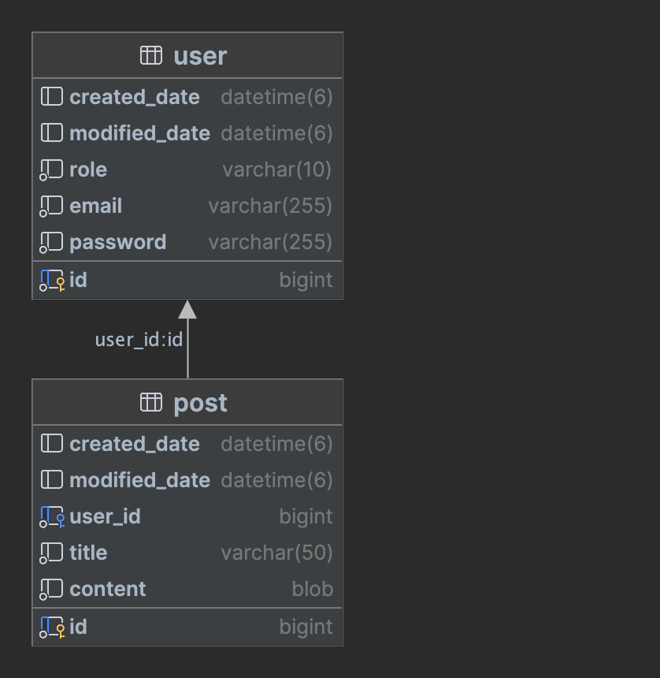

# 트립로그 (Triplog)

<br>

## 애플리케이션의 실행 방법

### 실행 조건

- docker image build & docker compose를 사용하기 때문에 docker service가 실행중이어야 한다.

### 실행 방법

1. 저장소를 로컬에 clone

```shell
git clone https://github.com/piopoi/triplog.git
```

2. 프로젝트 경로로 이동

```shell
cd [프로젝트 경로]
```

3. 배포 스크립트 실행

```shell
./deploy.sh
```

- deploy.sh 요약
    - git fetch, git pull
    - gradlew clean build
    - Remove previous docker container
    - Remove previous docker image
    - docker compose up

4. API 명세
   - file : [src/main/resources/static/docs/index.html](src/main/resources/static/docs/index.html)
   - app 실행 후 url: [http://localhost:8080/docs/index.html](http://localhost:8080/docs/index.html)
   <br>

[//]: # (## DB Diagram)
[//]: # ()
[//]: # (<br>)

## 사용 기술

### Application & DB

현재 시점의 stable 중 가장 최신 버전 사용.

- spring boot 3.1.2
- spring framework 6.0.11
- spring security 6.1.2
- spring rest docs 3.0.0
- mysql 8.0.34

### Deploy

- docker
- docker compose
- shell script

## 구현 기능

- 통합/단위 테스트 코드 작성.
- 사용자
  - 생성 / 조회 / 비밀번호 수정 / 삭제
- 로그인
    - JWT 인증
- 게시글
  - 생성 / 전체조회 / 단건조회 / 수정 / 삭제
  - 댓글 생성

## 잡담

- [Layered Architecture](https://www.google.com/search?q=Layered+Architecture)
- TDD
- DDD
  <br>

## API 명세(request/response 포함)

[API Documentation 바로가기](src/main/resources/static/docs/index.html)

- 문서 위치: src/main/resources/static/docs/index.html
- build 할 때마다 새로 생성.
